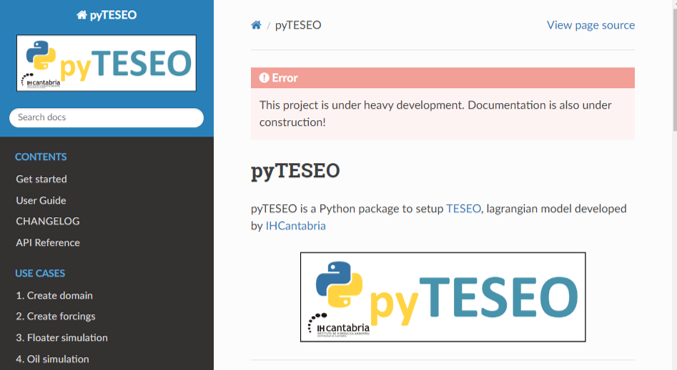

## :warning: Package under development!
## :soon: First usable version (v1.0.0) will be released soon
---

<p align="center">

</p>


[](https://github.com/IHCantabria/pyteseo/tags)
[](https://github.com/IHCantabria/pyteseo/commits/main)


[](https://github.com/IHCantabria/pyteseo/blob/main/LICENSE.md)
[](https://github.com/psf/black)
[](https://ihcantabria.github.io/pyteseo)


**pyTESEO** is a python package developed by [IHCantabria](https://ihcantabria.com/en/) to simplify and facilitate the setup and processing of [TESEO](https://ihcantabria.com/en/specialized-software/teseo/) simulations *(TESEO is a lagrangian numerical model also developed by IHCantabria.)*


---

## :house: Local installation

* Install from github repositorie using `pip`:
```bash
pip install git+https://github.com/IHCantabria/pyteseo
# To install extra dev dependencies: pip install git+https://github.com/IHCantabria/pyteseo[dev]
# Using editable mode: pip install -e git+https://github.com/IHCantabria/pyteseo[dev]

```

* :warning: `UNDER CONSTRUCTION` :construction: - Installation from github repository using pip:
```bash
pip install pyteseo
```
* :warning: `UNDER CONSTRUCTION` :construction: - Install from conda-forge repository:
```bash
conda install -c conda-forge pyteseo 
```

---

## :books: Documentation

Comprenhensive documentation is developed and mantained at https://ihcantabria.github.io/pyteseo

Documentation of all the package, usage and examples based on mockup input data are provided in [Jupyter Notebooks](https://jupyter.org/) format and ready to be used under [Google Colab](https://colab.research.google.com/) online platform.




---

## :heavy_check_mark: Testing & Coverage
Tests are located at `tests/` and data required for tests are located in `test/data/`. You need to run cli commands from the package installation path (`pip show teseo` to show current installation path)

Run tests to verify your package installation:
```bash
pyteseo-test            # Run tests and prompt pytest-report
```
Also, you can run coverage assesment and generate html report:
```bash
pyteseo-coverage        # Run coverage and prompt coverage-report
pyteseo-coverage-html   # Run coverage and bluid coverage-html-report
```
Tests have been developed using [pytest](https://docs.pytest.org/).

---

## :recycle: Continuous integration and deployment (CI & CD)

:warning: `THINK AND DEVELOP!` (If able use precommit and github actions when push tags)
* deploy documentation on github page -> github action :heavy_check_mark:
* pass format -> Balck :x:
* pass linter -> ? :x:
* pass tests -> pytest :x:
* make documentation -> sphinx :x:
* install and pass tests in different systems -> github actions :x:

*For all the SO (Windows, Linux, Mac), and python versions (3.10) required!*

---

## :copyright: Credits
Developed and maintained by :man_technologist: [German Aragon](https://github.com/aragong) @ :office: [IHCantabria](https://github.com/IHCantabria).

---